# 新手熟悉现有系统？从这些方面入手

## 概述

### 背景

在软件开发工作中，我们经常面临以下场景：
- **接手现有系统**：接手他人负责的系统，缺乏完整文档，需要快速摸清系统全貌
- **新员工入职**：需要快速了解系统全貌，但文档分散、信息零散，学习效率低
- **系统交接**：交接时遗漏关键信息，导致后续维护困难
- **架构演进**：缺乏系统现状的完整认知，难以做出合理的架构决策
- **AI辅助梳理**：希望借助AI自动生成系统文档，但缺乏结构化的提示词模板

这些问题的根源在于：**缺乏一套结构化、标准化的系统梳理框架**。

本清单旨在解决上述问题，提供一套完整的梳理框架，帮助使用者系统化地了解和记录系统信息。

### 文档定位

> **视角**：后端开发视角（关注系统架构、技术实现、数据存储、工程运维）
> 
> **定位**：后端系统梳理的结构化检查清单与可复用模板，支持人工梳理和AI生成
> 
> **用途**：
> - 作为系统梳理时的检查清单和模板
> - **作为AI生成提示词**：将本文档作为Prompt提供给AI，AI可根据模板自动生成系统梳理文档

### 目标

**清单目标**（使用这个清单能达成什么）：
- 系统化梳理：提供结构化的梳理框架，避免遗漏关键信息
- 建立认知框架：帮助使用者快速建立系统的完整认知
- 标准化输出：确保梳理产出的内容格式统一、内容完整
- 知识沉淀：形成可复用、可传承的系统文档

### 适用人群

**清单使用者**（谁会使用这个清单去梳理系统）：
- 架构师/技术负责人：系统化梳理系统现状，为架构演进提供依据
- 新入职员工：按清单系统化了解系统，建立完整认知
- 系统交接人员：确保知识完整传递，避免遗漏关键信息

### AI使用说明

> **说明**：本文档即为《系统梳理内容清单》，包含业务层（Why）、系统层（What）、工程层（How）三大维度的结构化梳理模板。

将本文档提供给AI时，可使用以下提示词：

```
请根据《系统梳理内容清单》中的模板，帮我梳理 [系统名称] 系统。

请按以下顺序输出：
1. 先输出P0优先级的梳理内容
2. 我会提供系统相关信息（代码、文档、访谈记录等）
3. 请按照文档中的模板格式输出梳理结果
```

**AI生成建议**：
- 提供代码仓库链接或关键代码文件，AI可自动分析技术栈、架构等
- 提供现有文档链接，AI可提取并结构化信息
- 分阶段提供信息，先P0后P1，避免信息过载

---

## 梳理优先级定义

| 优先级 | 定义 | 说明 |
|--------|------|------|
| **P0** | 必须梳理 | 缺失会严重影响系统理解，必须完成 |
| **P1** | 建议梳理 | 有助于全面掌握系统，建议完成 |
| **P2** | 选做 | 锦上添花，时间充裕时完成 |

---

## 清单总览

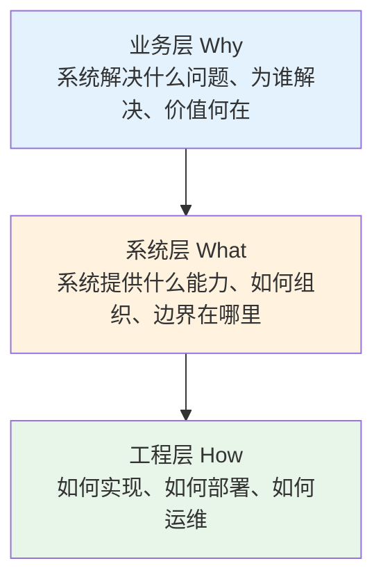
> 📊 使用 [Mermaid graph](https://mermaid.js.org/syntax/flowchart.html) 绘制

---

## 一、业务层：梳理内容清单

### 1.1 行业与定位

| 梳理项 | 说明 | 参考信息来源 | 优先级 |
|--------|------|----------|--------|
| 所属行业 | 系统服务的行业领域（如：电商、金融、教育） | 公司官网、产品介绍 | P0 |
| 细分领域 | 行业中的具体业务方向 | 产品经理、业务方 | P0 |
| 市场定位 | 系统在产业链中的位置、目标客户群体 | 产品经理、行业报告 | P1 |
| 竞品情况 | 主要竞品及其技术方案、差异化优势 | 产品经理、市场部门 | P1 |

**行业与定位梳理模板**：

| 梳理项 | 内容 | 说明 |
|--------|------|------|
| 所属行业 | 电商 | 如：电商、金融、教育、医疗 |
| 细分领域 | 跨境B2C | 如：电商-跨境B2C、金融-消费信贷 |
| 目标客户 | 海外中小零售商 | 采购系统的企业/决策者 |
| 目标用户 | 采购专员、仓库管理员 | 实际使用系统的人群 |
| 市场定位 | 一站式跨境采购平台 | 在产业链中的位置 |
| 主要竞品 | 阿里巴巴国际站、1688 | 竞品名称、技术特点 |
| 差异化优势 | 专注小B端、极速发货 | 与竞品相比的优势 |

### 1.2 用户与价值

| 梳理项 | 说明 | 参考信息来源 | 优先级 |
|--------|------|----------|--------|
| 用户角色 | 系统的核心用户群体 | 产品经理、运营 | P0 |
| 用户画像 | 各角色的特征、诉求 | 产品文档、用户调研 | P1 |
| 核心诉求 | 用户最想解决的问题 | 产品经理、用户反馈 | P0 |
| 业务价值 | 系统创造的直接/间接价值 | 产品经理、业务方 | P1 |

**用户角色梳理模板**：

| 用户角色 | 角色特征 | 核心诉求 | 使用频率 | 关键功能 |
|----------|----------|----------|----------|----------|
| 运营人员 | 负责活动配置 | 快速创建活动 | 每日 | 活动管理 |
| 商家 | 负责商品管理 | 实时查看销量 | 每日 | 数据报表 |
| 采购员 | 负责采购下单 | 快速比价下单 | 每周 | 采购管理 |

### 1.3 业务领域概念名词解释

> **说明**：本节聚焦于**业务领域相关的概念名词**，帮助新人快速理解业务术语。技术相关的术语（如技术栈、中间件、架构模式等）请参见「2.4 技术架构」。

| 梳理项 | 说明 | 参考信息来源 | 优先级 |
|--------|------|----------|--------|
| 核心术语 | 业务领域的专业名词 | 产品文档、技术文档 | P0 |
| 业务概念 | 业务层面的抽象概念 | 产品经理、业务方 | P0 |

**领域概念梳理模板**：

> **说明**：术语名称统一使用"中文名(英文名)"格式，英文名用于后续代码、数据库字段命名，实现统一语言。
>
> **分类建议**：当概念数量较多时，建议按业务域分组呈现，便于查找和理解。

#### 按业务域分类示例

**商品域**

| 术语/概念(中文) | 英文名 | 全称 | 含义 | 在本系统中的特殊定义 |
|-----------|--------|------|------|---------------------|
| 库存单元 | SKU | Stock Keeping Unit | 库存量单位 | 具体的商品规格组合（如颜色+尺码） |
| 标准产品 | SPU | Standard Product Unit | 标准产品单位 | 一类商品的抽象（如iPhone 15） |

**订单域**

| 术语/概念(中文) | 英文名 | 全称 | 含义 | 在本系统中的特殊定义 |
|-----------|--------|------|------|---------------------|
| 履约 | Fulfillment | - | 订单交付的全过程 | 包含拣货、发货、配送、签收 |

**营销域**

| 术语/概念(中文) | 英文名 | 全称 | 含义 | 在本系统中的特殊定义 |
|-----------|--------|------|------|---------------------|
| 卡券 | Coupon | - | 优惠券/兑换券的统称 | 本系统中包含满减券、折扣券、礼品券 |

### 1.4 业务流程

| 梳理项 | 说明 | 参考信息来源 | 优先级 |
|--------|------|----------|--------|
| 核心业务流程 | 端到端的主业务流程 | 产品经理、业务方 | P0 |
| 关键业务场景 | 高频、高价值的业务场景 | 产品经理、数据分析 | P0 |
| 异常处理流程 | 失败、超时、回滚等异常场景 | 技术负责人、测试 | P1 |
| 业务规则 | 业务约束、限制条件 | 产品文档、需求规格 | P1 |

**业务流程梳理模板**：

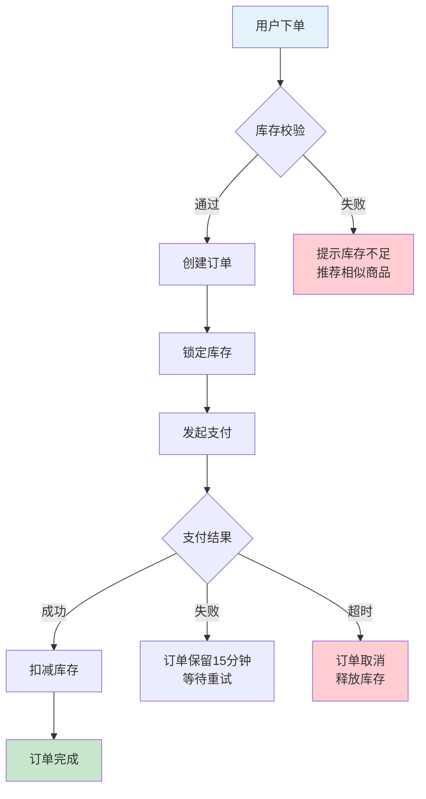
> 📊 使用 [Mermaid flowchart](https://mermaid.js.org/syntax/flowchart.html) 绘制

**流程说明**：
- **触发条件**：用户提交订单
- **参与角色**：用户、订单系统、库存系统、支付系统
- **关键规则**：
  - 单笔订单商品数量上限：50件
  - 订单支付超时时间：15分钟
  - 库存锁定时间：30分钟

### 1.5 功能架构

| 梳理项 | 说明 | 参考信息来源 | 优先级 |
|--------|------|----------|--------|
| 功能模块 | 系统的功能划分 | 产品文档、菜单结构 | P0 |
| 核心功能 | 每个模块的核心功能点 | 产品经理、功能清单 | P0 |
| 功能关系 | 模块间的依赖关系 | 产品经理、技术负责人 | P1 |

**功能架构梳理模板**：

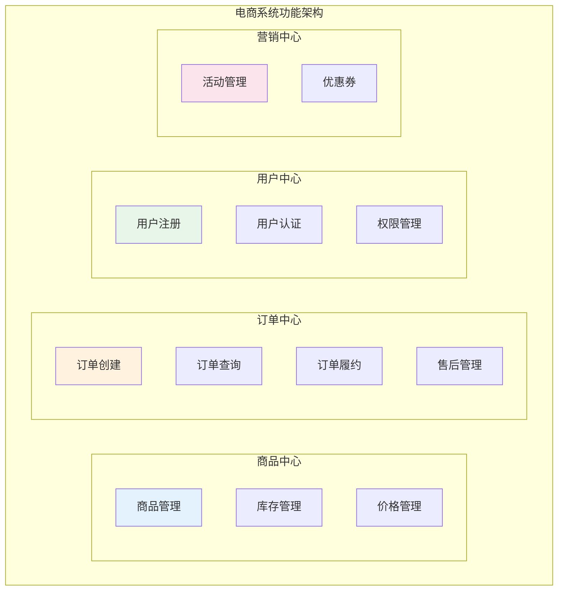
> 📊 使用 [Mermaid graph](https://mermaid.js.org/syntax/flowchart.html) 绘制

---

## 二、系统层：梳理内容清单

### 2.1 系统边界

| 梳理项 | 说明 | 参考信息来源 | 优先级 |
|--------|------|----------|--------|
| 系统定位 | 系统的职责边界 | 架构文档、技术负责人 | P0 |
| 上游调用方 | 调用本系统的外部系统或用户 | 架构图、接口文档 | P0 |
| 下游依赖-业务系统 | 依赖的其他业务系统 | 架构图、接口文档 | P0 |
| 下游依赖-平台服务 | 依赖的基础能力平台（支付、短信、推送等） | 架构图、接口文档 | P0 |
| 系统交互 | 系统间的调用关系 | 调用链追踪、配置 | P0 |
| 通信协议 | 系统间通信方式 | 接口文档、配置 | P1 |

> **说明**：本节聚焦**业务层面的系统交互**。技术基础设施（数据库、缓存、消息队列、RPC框架等）参见「2.4 技术架构」和「2.5 数据架构」。

**依赖类型说明**：

| 依赖类型 | 说明 | 典型示例 |
|----------|------|----------|
| 业务系统 | 承载业务逻辑的外部系统，有明确的业务语义 | 用户中心、商品中心、风控系统 |
| 平台服务 | 提供通用能力的基础平台，通常有独立的管理后台 | 支付平台、短信平台、推送平台 |

**系统边界梳理模板**：

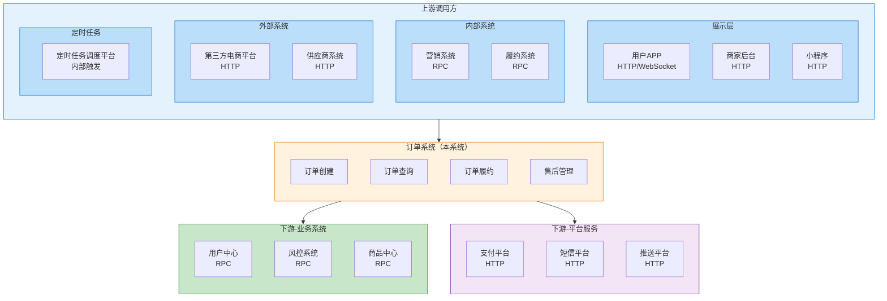
> 📊 使用 [Mermaid flowchart](https://mermaid.js.org/syntax/flowchart.html) 绘制
>
> **说明**：图中"订单系统"为示例，实际使用时替换为目标系统名称。系统内部列出核心模块/服务，连线表示模块级别的调用关系。

**上游调用方类型说明**：

| 调用类型 | 通信协议 | 说明 | 典型示例 |
|----------|----------|------|----------|
| 展示层-APP端 | HTTP/HTTPS、WebSocket | 移动端应用，可能有长连接需求 | iOS APP、Android APP |
| 展示层-Web端 | HTTP/HTTPS | 浏览器访问，标准Web请求 | 商家后台、管理后台、H5页面 |
| 展示层-小程序 | HTTP/HTTPS | 微信/支付宝等小程序 | 微信小程序、支付宝小程序 |
| 内部系统调用 | RPC/Dubbo | 公司内部其他业务系统的调用 | 营销系统、履约系统、财务系统 |
| 外部系统调用 | HTTP/HTTPS | 外部合作伙伴系统的调用 | 第三方电商平台、供应商系统 |
| 定时任务调用 | 内部触发 | 定时任务调度平台触发的调用 | XXL-Job、SchedulerX |

**下游依赖梳理模板**：

| 依赖名称 | 类型 | 通信方式 | 依赖用途 | 调用频率 | 可用性要求 | 负责人 |
|----------|------|----------|----------|----------|------------|--------|
| 用户中心 | 业务系统 | RPC | 获取用户信息、权限校验 | 高 | 高 | 用户组 |
| 风控系统 | 业务系统 | RPC | 订单风控校验 | 中 | 高 | 风控组 |
| 商品中心 | 业务系统 | RPC | 查询商品信息 | 高 | 高 | 商品组 |
| 支付平台 | 平台服务 | HTTP | 发起支付、查询结果 | 中 | 极高 | 平台组 |
| 短信平台 | 平台服务 | HTTP | 发送短信验证码 | 低 | 中 | 平台组 |
| 推送平台 | 平台服务 | HTTP | 发送App推送通知 | 中 | 中 | 平台组 |

### 2.2 系统组成

| 梳理项 | 说明 | 参考信息来源 | 优先级 |
|--------|------|----------|--------|
| 子系统/模块 | 系统内部划分 | 架构文档、代码结构 | P0 |
| 模块职责 | 各模块的核心职责 | 技术负责人、代码 | P0 |
| 模块关系 | 模块间依赖关系 | 代码、调用链 | P1 |

> **粒度说明**：系统组成的粒度取决于架构风格，与代码仓库存在对应关系：
>
> | 架构风格 | 系统组成粒度 | 与代码仓库关系 |
> |----------|--------------|----------------|
> | 微服务架构 | 服务级别（如订单服务、商品服务） | 一个服务 = 一个代码仓库 |
> | 单体应用 | 模块级别（如订单模块、商品模块） | 多个模块 = 一个代码仓库 |
> | SOA架构 | 子系统级别 | 一个子系统 = 一个代码仓库 |
>
> 本节梳理的是**业务视角的系统组成**，技术视角的工程结构详见「3.1 代码仓库」和「3.2 工程结构」。

**整体关系图**：

```
2.2 系统组成（业务视角，服务/模块级别）
    ↓ 对应
3.1 代码仓库（仓库视角，与系统组成一一对应或多对一）
    ↓ 内部结构
3.2 工程结构（代码视角，单个服务/模块内部目录组织）
```

**系统组成梳理模板**（以微服务架构为例）：

| 服务/模块名 | 职责 | 核心接口 | 依赖服务/模块 | 负责人 | 对应代码仓库 |
|-------------|------|----------|---------------|--------|--------------|
| 订单服务 | 订单生命周期管理 | 创建订单、查询订单 | 库存、支付、用户 | 张三 | order-service |
| 商品服务 | 商品信息管理 | 商品CRUD、库存查询 | 无 | 李四 | product-service |
| 用户服务 | 用户认证授权 | 登录、注册、权限 | 无 | 王五 | user-service |

**模块间依赖关系图**：

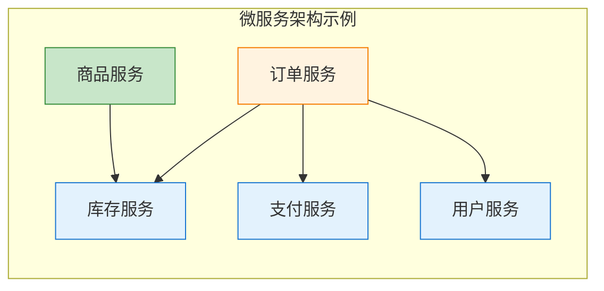
> 📊 使用 [Mermaid flowchart](https://mermaid.js.org/syntax/flowchart.html) 绘制

### 2.3 领域概念模型

> **说明**：本节聚焦于**业务认知层面的概念梳理**，帮助新人快速理解"系统在业务上有哪些核心概念、它们之间是什么关系"。这与DDD中的"领域模型"（代码设计层面的建模方法）是不同的概念，详见[领域概念模型 vs DDD领域模型](基础/领域概念模型vsDDD领域模型.md)。

| 梳理项 | 说明 | 参考信息来源 | 优先级 |
|--------|------|----------|--------|
| 核心业务概念 | 业务领域的核心名词 | 产品文档、业务方 | P0 |
| 概念关系 | 概念间的关联关系（1:1、1:N、N:N） | 产品文档、ER图 | P0 |
| 概念属性 | 每个概念的**核心关键属性**，用于识别概念、支撑业务场景，非全部属性 | 产品文档、数据表 | P0 |
| 业务语义 | 概念在**特定业务场景**中的具体含义，同一概念在不同场景可能有不同语义 | 产品经理、业务方 | P1 |

**业务语义示例**：

| 概念 | 场景 | 业务语义 |
|------|------|----------|
| 用户 | 下单场景 | 指下单人，需要关注收货地址、支付方式 |
| 用户 | 售后场景 | 指投诉人，需要关注历史订单、会员等级 |
| 用户 | 营销场景 | 指目标人群，需要关注用户标签、活跃度 |
| 订单 | 财务场景 | 指交易记录，关注金额、支付方式、发票 |
| 订单 | 履约场景 | 指待发货单，关注收货地址、商品明细、物流要求 |

**领域概念模型梳理模板**：

> **说明**：概念名称统一使用"中文名(英文名)"格式，英文名用于后续代码、数据库字段命名，实现统一语言。

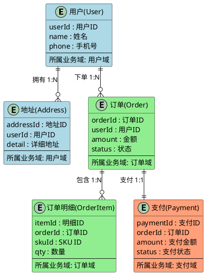
> 📊 使用 [PlantUML Entity Relationship](https://plantuml.com/zh/ie-diagram) 绘制

**概念对照表**：

| 英文名 | 中文名 | 说明 |
|--------|--------|------|
| User | 用户 | 平台注册的购买者 |
| Order | 订单 | 用户的一次购买记录 |
| OrderItem | 订单明细 | 订单中的具体商品 |
| Address | 地址 | 用户的收货地址 |
| Payment | 支付 | 订单的支付记录 |

**概念说明模板**：

| 概念名称 | 业务含义 | 核心属性 | 与其他概念的关系 | 业务场景 |
|----------|----------|----------|------------------|----------|
| 用户(User) | 平台注册的购买者 | userId、name、phone | 下单→订单、拥有→地址 | 注册、下单、查询订单 |
| 订单(Order) | 用户的一次购买记录 | orderId、amount、status | 属于→用户、包含→订单明细 | 下单、支付、发货、售后 |
| 订单明细 | 订单中的具体商品 | 明细ID、SKU、数量 | 属于→订单 | 商品拆分、库存扣减 |

### 2.4 技术架构

| 梳理项 | 说明 | 参考信息来源 | 优先级 |
|--------|------|----------|--------|
| 整体架构 | 分层架构、架构风格 | 架构文档、代码 | P0 |
| 技术栈 | 使用的技术框架和版本 | pom.xml、package.json | P0 |
| 中间件 | 使用的中间件及版本 | 配置文件、运维文档 | P0 |
| 数据存储 | 数据库、缓存等存储方案 | 配置文件、架构图 | P0 |
| 技术术语 | 系统特有的技术术语解释 | 技术文档、代码 | P1 |

#### 2.4.0 技术术语解释

> **说明**：本节记录系统特有的技术术语定义，帮助新人快速理解技术概念。通用技术术语（如RESTful、JWT等）无需记录。

| 术语 | 全称 | 含义 | 在本系统中的特殊定义 |
|------|------|------|---------------------|
| RPC接口 | Remote Procedure Call | 远程过程调用接口 | 本系统中特指给前端无线端（APP）提供的内部接口 |
| HTTP接口 | HTTP API | 基于HTTP协议的接口 | 本系统中特指给Web端、小程序提供的接口 |
| 内部接口 | Internal API | 系统内部服务间调用的接口 | 本系统内部各服务间的Dubbo接口 |
| 开放接口 | Open API | 对外开放的接口 | 供第三方系统调用的接口，需签名验证 |
| 无线网关 | Wireless Gateway | 移动端统一入口 | APP端请求的统一网关，负责鉴权、限流、路由 |
| Web网关 | Web Gateway | Web端统一入口 | 浏览器请求的统一网关，支持Cookie鉴权 |

**技术栈梳理模板**：

**开发语言与框架**

| 类别 | 技术选型 | 版本 | 用途说明 | 备注 |
|------|----------|------|----------|------|
| 开发语言 | Java | 17 | 后端开发 | LTS版本 |
| 开发框架 | Spring Boot | 3.2.x | 应用框架 | |
| ORM框架 | MyBatis-Plus | 3.5.x | 数据访问 | |

**数据存储**

| 类别 | 技术选型 | 版本 | 用途说明 | 备注 |
|------|----------|------|----------|------|
| 关系型数据库 | MySQL | 8.0 | 主数据库 | 主从架构 |
| 缓存 | Redis | 7.x | 分布式缓存 | 集群模式 |
| 搜索引擎 | Elasticsearch | 8.x | 商品搜索 | |

**中间件**

| 类别 | 技术选型 | 版本 | 用途说明 | 备注 |
|------|----------|------|----------|------|
| 消息队列 | RocketMQ | 5.x | 异步消息、解耦 | |
| RPC框架 | Dubbo | 3.x | 服务间调用 | |
| 注册中心 | Nacos | 2.x | 服务注册发现、配置中心 | |
| 定时任务 | XXL-Job | 2.x | 分布式任务调度 | |

**监控运维**

| 类别 | 技术选型 | 版本 | 用途说明 | 备注 |
|------|----------|------|----------|------|
| 指标监控 | Prometheus + Grafana | - | 指标采集与可视化 | |
| 链路追踪 | SkyWalking | 9.x | 分布式链路追踪 | |
| 日志收集 | ELK | - | 日志采集与查询 | |

#### 2.4.1 架构分层

| 梳理项 | 说明 | 参考信息来源 | 优先级 |
|--------|------|----------|--------|
| 分层模式 | MVC / DDD四层 / 六边形 / 整洁架构等 | 架构文档、代码 | P0 |
| 各层职责 | 每层的核心职责和约束 | 代码、设计文档 | P0 |
| 调用规则 | 层间调用方向、是否允许跨层 | 代码、架构规范 | P0 |
| 数据流转 | 请求从入口到存储经过哪些层 | 架构文档、代码 | P1 |

**架构分层梳理模板**：

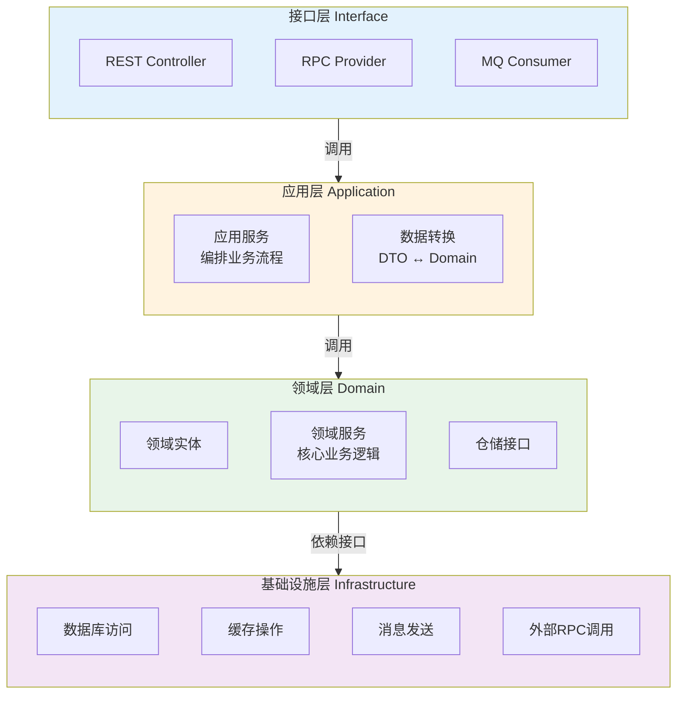
> 📊 使用 [Mermaid flowchart](https://mermaid.js.org/syntax/flowchart.html) 绘制

**分层职责说明模板**：

| 层级 | 职责 | 核心组件 | 调用规则 | 禁止事项 |
|------|------|----------|----------|----------|
| 接口层 | 接收外部请求、参数校验、响应封装 | Controller、Provider、Consumer | 可调用应用层 | 不含业务逻辑 |
| 应用层 | 编排业务流程、事务管理 | ApplicationService、DTO | 可调用领域层和基础设施层 | 不含领域逻辑 |
| 领域层 | 核心业务规则、领域模型 | Entity、DomainService、Repository接口 | 仅依赖仓储接口，不依赖基础设施实现 | 不依赖任何框架 |
| 基础设施层 | 技术实现细节 | Mapper、CacheClient、MQProducer | 实现领域层定义的接口 | 不包含业务逻辑 |

**请求流转示例模板**：

| 请求场景 | 入口 | 经过层级 | 数据变化 | 出口 |
|----------|------|----------|----------|------|
| 创建订单 | REST Controller | 接口层→应用层→领域层→基础设施层 | RequestDTO→OrderEntity→DO | 订单ID |
| 查询订单 | REST Controller | 接口层→应用层→基础设施层 | 无领域逻辑，直接查询 | OrderVO |
| 支付回调 | MQ Consumer | 接口层→应用层→领域层→基础设施层 | PaymentEvent→OrderEntity→DO | 无 |

### 2.5 数据架构

#### 2.5.1 数据存储全景

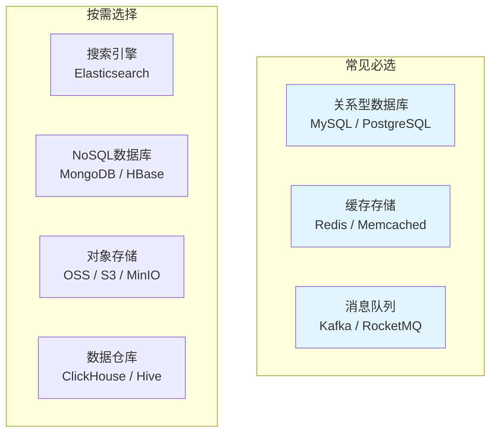
> 📊 使用 [Mermaid graph](https://mermaid.js.org/syntax/flowchart.html) 绘制

#### 2.5.2 关系型数据库

| 梳理项 | 说明 | 优先级 |
|--------|------|--------|
| 数据库类型及版本 | MySQL/PostgreSQL/Oracle等 | P0 |
| 实例信息 | 主从配置、集群规模 | P0 |
| 核心数据表 | 最重要的业务表 | P0 |
| 数据量级 | 各表数据量、增长趋势 | P1 |
| 分库分表 | 分片策略、路由规则 | P1 |

**核心数据表梳理模板**：

| 表名 | 中文名 | 数据量 | 日增量 | 核心字段 | 索引 | 说明 |
|------|--------|--------|--------|----------|------|------|
| t_order | 订单表 | 500万 | 5万 | order_id,user_id,status | idx_user_id | 核心业务表 |
| t_order_item | 订单明细 | 1500万 | 15万 | item_id,order_id,sku_id | idx_order_id | 订单明细 |
| t_product | 商品表 | 10万 | 500 | product_id,name,price | idx_status | 商品信息 |

#### 2.5.3 缓存存储

| 梳理项 | 说明 | 优先级 |
|--------|------|--------|
| 缓存类型及版本 | Redis/Memcached等 | P0 |
| 部署架构 | 单机/主从/集群/哨兵 | P0 |
| 缓存用途 | 会话缓存/数据缓存/分布式锁等 | P0 |
| 缓存策略 | 缓存Key设计、过期策略 | P0 |

**缓存使用梳理模板**：

| 缓存名 | 类型 | 用途 | Key格式 | 过期时间 | 备注 |
|--------|------|------|---------|----------|------|
| user-cache | Redis Cluster | 数据缓存 | user:{id} | 1小时 | 用户信息 |
| lock-cache | Redis | 分布式锁 | lock:{key} | 30秒 | 防重复提交 |
| session-cache | Redis | 会话存储 | session:{id} | 30分钟 | 登录态 |

#### 2.5.4 消息队列

| 梳理项 | 说明 | 优先级 |
|--------|------|--------|
| 消息队列类型及版本 | Kafka/RocketMQ/RabbitMQ等 | P0 |
| 集群架构 | Broker数量、部署方式 | P0 |
| Topic设计 | Topic命名、分区数 | P0 |
| 消费模式 | 推模式/拉模式、消费组 | P0 |

**Topic梳理模板**：

| Topic名 | 用途 | 生产者 | 消费者 | 分区数 | 消息类型 |
|---------|------|--------|--------|--------|----------|
| order-created | 订单创建消息 | 订单服务 | 库存服务、营销服务 | 8 | 普通消息 |
| payment-result | 支付结果消息 | 支付服务 | 订单服务 | 4 | 顺序消息 |

#### 2.5.5 数据流转

**数据流转梳理模板**：

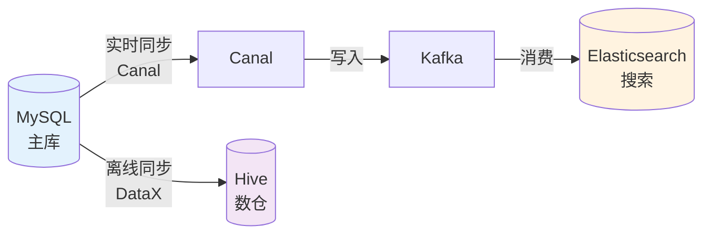
> 📊 使用 [Mermaid graph](https://mermaid.js.org/syntax/flowchart.html) 绘制

### 2.6 接口设计

| 梳理项 | 说明 | 参考信息来源 | 优先级 |
|--------|------|----------|--------|
| 对外接口 | 暴露给外部的API | 接口文档、代码 | P0 |
| 内部接口 | 系统内部调用接口 | 代码、接口文档 | P1 |
| 接口协议 | HTTP/RPC/消息等 | 接口文档 | P0 |
| 接口鉴权 | 认证授权方式 | 接口文档、代码 | P0 |
| 接口限流 | 限流规则、熔断降级配置 | 配置文件、代码 | P1 |

**接口梳理模板**：

| 接口名称 | 协议类型 | 认证方式 | 限流规则 | SLA | 文档地址 |
|----------|----------|----------|----------|-----|----------|
| 用户登录API | HTTP/REST | JWT | 100次/分钟 | P99<200ms | /doc/user/login |
| 订单创建API | HTTP/REST | OAuth2 | 50次/秒 | P99<500ms | /doc/order/create |
| 库存扣减RPC | Dubbo | 内部认证 | 熔断:RT>1s | P99<100ms | 内部文档 |

### 2.7 安全架构

| 梳理项 | 说明 | 优先级 |
|--------|------|--------|
| 认证方式 | 用户身份认证机制 | P0 |
| 授权模型 | 权限控制模型（RBAC/ABAC等） | P0 |
| 敏感数据 | 敏感数据识别及加密存储 | P0 |
| 数据脱敏 | 日志/展示时的脱敏规则 | P1 |
| 安全边界 | 防火墙、WAF、安全组配置 | P1 |
| API安全 | 签名验证、防重放、接口加密 | P0 |

**认证授权梳理模板**：

| 认证方式 | 适用场景 | Token有效期 | 刷新机制 | 备注 |
|----------|----------|-------------|----------|------|
| JWT | 移动端/API | 2小时 | Refresh Token | 无状态 |
| Session | Web端 | 30分钟 | 滑动过期 | 需要存储 |
| OAuth2 | 第三方登录 | 1小时 | Refresh Token | 标准协议 |

**敏感数据梳理模板**：

| 数据类型 | 数据项 | 加密方式 | 脱敏规则 | 访问权限 |
|----------|--------|----------|----------|----------|
| 用户隐私 | 手机号 | AES256 | 138****1234 | 仅授权人员 |
| 用户隐私 | 身份证 | AES256 | 110***********1234 | 仅授权人员 |
| 支付信息 | 银行卡 | AES256+HSM | 6222****1234 | 支付系统 |

---

## 三、工程层：梳理内容清单

### 3.1 代码仓库

| 梳理项 | 说明 | 参考信息来源 | 优先级 |
|--------|------|----------|--------|
| 仓库地址 | 代码仓库URL | 技术负责人 | P0 |
| 分支策略 | 分支管理规范 | 开发规范文档 | P0 |
| 构建方式 | 构建、打包方式 | CI配置、构建脚本 | P0 |
| 代码规范 | 编码规范、代码风格 | 开发规范文档 | P1 |

> **与系统组成的关系**：代码仓库与「2.2 系统组成」中的服务/模块一一对应（微服务架构），或多个模块对应一个仓库（单体架构）。

**代码仓库梳理模板**（以微服务架构为例）：

| 仓库名 | 对应服务/模块 | 地址 | 说明 | 负责人 | 分支策略 |
|--------|---------------|------|------|--------|----------|
| order-service | 订单服务 | git@xxx/order.git | 订单服务 | 张三 | GitFlow |
| product-service | 商品服务 | git@xxx/product.git | 商品服务 | 李四 | Trunk Based |
| common-lib | 公共模块 | git@xxx/common.git | 公共库 | 王五 | 主干开发 |

### 3.2 工程结构

| 梳理项 | 说明 | 参考信息来源 | 优先级 |
|--------|------|----------|--------|
| 模块划分 | 代码模块结构 | 目录结构、pom.xml | P0 |
| 分层架构 | 代码分层方式 | 目录结构、代码 | P0 |
| 核心包 | 主要的包和职责 | 代码结构 | P1 |

> **与系统组成的关系**：工程结构是「2.2 系统组成」中服务/模块的代码实现视图，展示单个服务/模块内部的目录组织。每个服务/模块对应一份工程结构梳理。

**工程结构梳理模板**（以 order-service 代码仓库为例）：

```
project-name/
├── order-api/           # 订单API接口定义
│   └── src/main/java/
│       └── com.xxx.order.api/
│           ├── dto/         # 数据传输对象
│           └── facade/      # 对外接口
├── order-domain/        # 订单领域模型
│   └── src/main/java/
│       └── com.xxx.order.domain/
│           ├── entity/      # 领域实体
│           ├── service/     # 领域服务
│           └── repository/  # 仓储接口
├── order-infrastructure/    # 订单基础设施
│   └── src/main/java/
│       └── com.xxx.order.infra/
│           ├── mapper/      # 数据映射
│           ├── mq/          # 消息队列
│           └── rpc/         # RPC调用
├── order-application/   # 订单应用服务
│   └── src/main/java/
│       └── com.xxx.order.app/
│           ├── controller/  # 接口层
│           └── service/     # 应用服务
└── pom.xml
```

**架构分层与工程模块映射模板**（以 order-service 代码仓库为例）：

> 将2.4.1架构分层与工程目录的对应关系显式标注，帮助新人快速定位代码。

| 架构分层 | 工程模块 | 目录示例 | 核心职责 | 关键类/包 |
|----------|----------|----------|----------|-----------|
| 接口层 | order-api | api/dto, api/facade | 对外接口定义 | DTO、Facade接口 |
| 应用层 | order-application | app/controller, app/service | 流程编排、接口暴露 | Controller、ApplicationService |
| 领域层 | order-domain | domain/entity, domain/service, domain/repository | 核心业务逻辑 | Entity、DomainService、Repository接口 |
| 基础设施层 | order-infrastructure | infra/mapper, infra/mq, infra/rpc | 技术实现 | Mapper、MQProducer、RpcClient |

```
请求流转与代码定位示例：

创建订单请求 → Controller(order-application)
             → ApplicationService(order-application)
             → OrderEntity / OrderDomainService(order-domain)
             → OrderRepository接口(order-domain)
             → OrderMapper(order-infrastructure)
```

### 3.3 环境信息

| 梳理项 | 说明 | 参考信息来源 | 优先级 |
|--------|------|----------|--------|
| 环境列表 | 开发/测试/预发/生产 | 运维文档 | P0 |
| 环境地址 | 各环境访问地址 | 运维文档 | P0 |
| 账号信息 | 各环境账号密码 | 运维文档、密码管理 | P0 |
| 配置差异 | 各环境配置差异 | 配置文件、运维 | P1 |

**环境信息梳理模板**：

| 环境 | 地址 | 用途 | 账号管理 | 配置差异 | 备注 |
|------|------|------|----------|----------|------|
| 开发环境 | dev.xxx.com | 日常开发 | LDAP统一认证 | 单机部署 | 每日构建 |
| 测试环境 | test.xxx.com | 功能测试 | LDAP统一认证 | 主从部署 | 每周发布 |
| 预发环境 | staging.xxx.com | 发布前验证 | LDAP统一认证 | 与生产一致 | 发布前验证 |
| 生产环境 | www.xxx.com | 真实业务 | 生产账号审批 | 集群部署 | 变更审批 |

### 3.4 部署架构

| 梳理项 | 说明 | 参考信息来源 | 优先级 |
|--------|------|----------|--------|
| 部署方式 | 物理机/容器/K8s | 运维文档 | P0 |
| 服务器信息 | 服务器数量、配置 | 运维文档 | P1 |
| 网络架构 | 网络拓扑、负载均衡 | 运维文档 | P1 |
| 高可用方案 | 容灾、备份方案 | 运维文档 | P1 |

**部署架构梳理模板**：

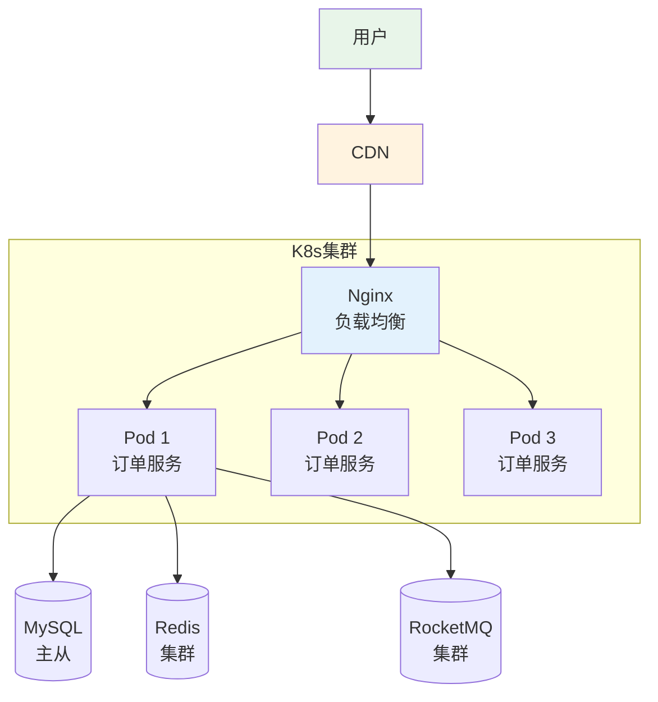
> 📊 使用 [Mermaid graph](https://mermaid.js.org/syntax/flowchart.html) 绘制

**部署信息**：
- 部署方式：Kubernetes
- 服务器：4核8G × 6台
- 高可用：跨可用区部署

### 3.5 监控运维

| 梳理项 | 说明 | 参考信息来源 | 优先级 |
|--------|------|----------|--------|
| 监控系统 | 使用的监控工具 | 运维文档 | P0 |
| 核心指标 | 关注的核心指标 | 监控大盘 | P0 |
| 告警配置 | 告警规则、阈值 | 监控配置 | P0 |
| 日志系统 | 日志收集、查询 | 运维文档 | P1 |
| 链路追踪 | 分布式追踪系统 | 架构文档 | P1 |
| SLO/SLI | 服务等级目标定义 | 架构文档 | P1 |

**监控指标梳理模板**：

| 指标类型 | 指标名称 | 阈值 | 说明 | 处理方案 |
|----------|----------|------|------|----------|
| 应用指标 | QPS | >1000 | 每秒请求数 | 扩容 |
| 应用指标 | RT | >500ms | 响应时间 | 排查慢接口 |
| 应用指标 | 错误率 | >1% | 错误比例 | 排查异常 |
| 系统指标 | CPU | >80% | CPU使用率 | 扩容/排查 |
| 系统指标 | 内存 | >85% | 内存使用率 | 排查内存泄漏 |
| 业务指标 | 订单量 | - | 每日订单数 | 业务监控 |

**SLO/SLI 定义模板**：

| 服务 | SLI指标 | SLO目标 | 测量周期 | 告警阈值 | 备注 |
|------|---------|---------|----------|----------|------|
| 订单服务 | 可用性 | 99.9% | 月度 | <99.5%告警 | 核心服务 |
| 订单服务 | 延迟(P99) | <500ms | 月度 | >800ms告警 | 核心接口 |
| 支付服务 | 可用性 | 99.99% | 月度 | <99.9%告警 | 关键服务 |

### 3.6 性能基线

| 梳理项 | 说明 | 优先级 |
|--------|------|--------|
| 接口性能基线 | 核心接口的响应时间 | P0 |
| 系统容量 | 当前容量、峰值承载能力 | P0 |
| 性能瓶颈 | 已知的性能瓶颈点 | P1 |
| 容量规划 | 未来容量需求、扩容计划 | P2 |

**接口性能基线模板**：

| 接口名称 | 平均RT | P95 RT | P99 RT | QPS上限 | 备注 |
|----------|--------|--------|--------|---------|------|
| 用户登录 | 50ms | 100ms | 200ms | 500 | 无外部依赖 |
| 商品查询 | 30ms | 80ms | 150ms | 2000 | 有缓存 |
| 订单创建 | 200ms | 500ms | 1000ms | 500 | 有分布式事务 |
| 支付处理 | 300ms | 800ms | 1500ms | 100 | 依赖外部支付 |

**系统容量梳理模板**：

| 资源类型 | 当前配置 | 当前使用率 | 峰值承载 | 扩容阈值 | 扩容方案 |
|----------|----------|------------|----------|----------|----------|
| 应用服务器 | 6台4核8G | 60% | 2000QPS | 80% | 自动扩容到12台 |
| MySQL主库 | 8核16G | 50% | 5000QPS | 70% | 升级配置/分库 |
| Redis集群 | 6节点8G | 40% | 50000QPS | 70% | 扩容节点 |

### 3.7 发布流程

| 梳理项 | 说明 | 参考信息来源 | 优先级 |
|--------|------|----------|--------|
| 发布流程 | 发布步骤、审批流程 | 发布文档 | P0 |
| 发布窗口 | 允许发布的时间段 | 发布规范 | P1 |
| 回滚方案 | 发布失败回滚步骤 | 发布文档 | P0 |
| 变更管理 | 变更分类、审批流程 | 变更管理文档 | P0 |

**发布流程梳理模板**：

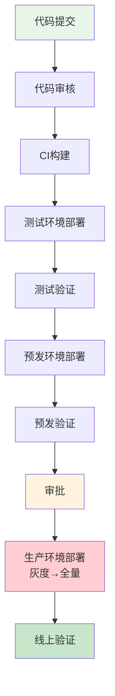
> 📊 使用 [Mermaid flowchart](https://mermaid.js.org/syntax/flowchart.html) 绘制

**发布规范**：
- 发布窗口：周二、周四 10:00-18:00
- 发布审批：技术负责人 + 产品负责人
- 回滚策略：一键回滚，5分钟内完成

### 3.8 技术债务

| 梳理项 | 说明 | 优先级 |
|--------|------|--------|
| 代码债务 | 代码质量问题、待重构模块 | P1 |
| 架构债务 | 架构设计缺陷、待优化设计 | P1 |
| 依赖债务 | 过期依赖、安全漏洞依赖 | P0 |
| 测试债务 | 测试覆盖率不足、缺失测试 | P1 |

**技术债务清单模板**：

| 债务编号 | 债务类型 | 债务描述 | 影响范围 | 偿还成本 | 优先级 | 计划时间 |
|----------|----------|----------|----------|----------|--------|----------|
| TD-001 | 代码债务 | 订单模块代码重复率高 | 订单服务 | 5人天 | P1 | 2025-Q2 |
| TD-002 | 架构债务 | 支付模块耦合度高 | 支付服务 | 10人天 | P1 | 2025-Q3 |
| TD-003 | 依赖债务 | Log4j版本存在安全漏洞 | 全系统 | 2人天 | P0 | 本周 |

---

## 四、关键信息清单

### 4.1 关键联系人

| 角色 | 姓名 | 联系方式 | 负责范围 |
|------|------|----------|----------|
| 技术负责人 | 张三 | 138xxxx / zhangsan@xxx.com | 技术架构、技术决策 |
| 产品负责人 | 李四 | 139xxxx / lisi@xxx.com | 产品规划、需求确认 |
| 运维负责人 | 王五 | 137xxxx / wangwu@xxx.com | 部署运维、监控告警 |
| 测试负责人 | 赵六 | 136xxxx / zhaoliu@xxx.com | 测试策略、质量把控 |
| DBA | 孙八 | 134xxxx / sunba@xxx.com | 数据库管理、SQL审核 |

### 4.2 关键文档清单

| 文档类型 | 文档名称 | 地址 | 说明 |
|----------|----------|------|------|
| 架构文档 | 系统架构设计文档 | /wiki/arch | 整体架构设计 |
| 接口文档 | API接口文档 | /swagger | REST API文档 |
| 设计文档 | 详细设计文档 | /wiki/design | 模块详细设计 |
| 运维文档 | 运维手册 | /wiki/ops | 部署运维指南 |
| 开发规范 | 编码规范 | /wiki/dev-guide | 代码规范、Git规范 |

### 4.3 常见问题FAQ

| 问题 | 答案 |
|------|------|
| 本地环境如何启动？ | 1. 克隆代码 2. 导入IDE 3. 配置本地环境变量 4. 启动依赖服务 5. 运行启动类 |
| 如何查看日志？ | 1. 本地：查看控制台输出 2. 测试环境：ELK日志平台 /logs 3. 生产环境：申请权限后查看 |
| 如何申请生产权限？ | 提交权限申请单，经技术负责人审批后开通 |

---

## 五、梳理产出物清单

| 产出物 | 格式 | 说明 |
|--------|------|------|
| 系统架构图 | 图 | 展示系统组成和边界 |
| 核心业务流程图 | 图 | 端到端业务流程 |
| 数据模型图 | 图 | 核心表及关系 |
| 技术栈清单 | 表 | 使用的技术和版本 |
| 环境信息表 | 表 | 各环境地址和账号 |
| 关键联系人表 | 表 | 各角色负责人 |

---

> 💡 **提示**：本清单为通用模板，实际梳理时根据系统特点裁剪。核心是抓住P0项，建立系统全貌认知。